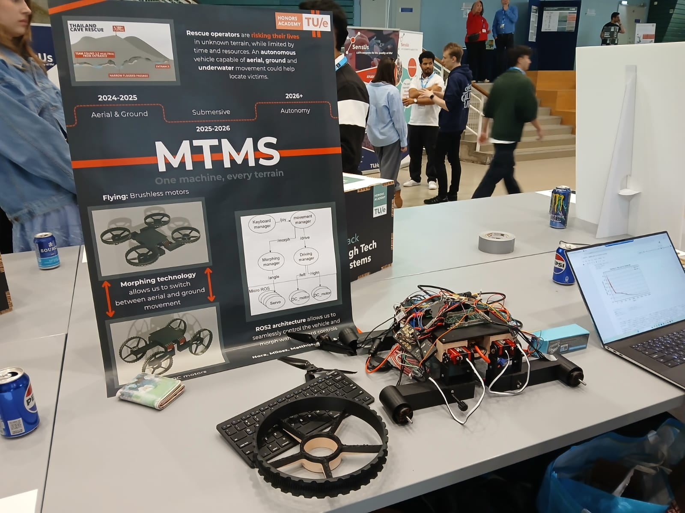
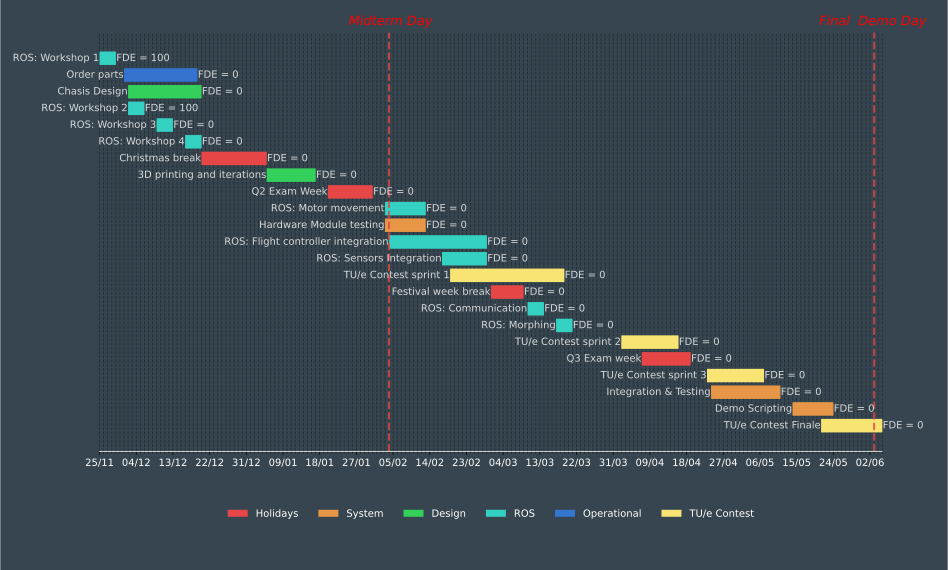

<p align="center">
  
</p>

<p align="center">
  
</p>

---

## 🚀 Project Overview

MTMS is a **Multi-Terrain Mobility System** developed for the Honors High Tech Systems track. The project aims to create a versatile robotic system capable of adapting between land and air transportation modes using the ROS 2 frameworks.

### Features

- 🚗 **Car Mode**: Smooth navigation on land.
- 🛩️ **Drone Mode**: Agile flight for aerial traversal.
- 🤖 **ROS 2 Integration**: Scalable robotics framework.
- 🛠️ **Custom Hardware**: Tailored for land-air adaptability.

---

## 📚 Table of Contents

- [🚀 Project Overview](#-project-overview)
  - [Features:](#features)
- [📚 Table of Contents](#-table-of-contents)
- [📅 Timeline \& Roadmap](#-timeline--roadmap)
- [🛠️ Setup Instructions](#️-setup-instructions)
  - [Prerequisites:](#prerequisites)
  - [Steps:](#steps)
- [👥 Contributors](#-contributors)
  - [Team MTMS:](#team-mtms)

---

## 📅 Timeline & Roadmap

Here is the Gantt chart outlining the project schedule and milestones:



---

## 🛠️ Setup Instructions

### Prerequisites

- **Hardware**:
  - Raspberry pi 5
  - Drone & Car Mechanical Components
  - Pixhawk 6C
  - Arduino Due
  - 22.2V 4000mAh 150C Graphy Battery
- **Software**:
  - ROS 2 (Jazzy)
  - Python 3.8+
  - CMake 3.16+
  - TODO fill list

### Steps

1. **Clone the Repository**:

   ```bash
   git clone git@github.com:HighTechSystems2024-2025/MTMS.git
   cd MTMS

TODO finish getting started

1. **Install Dependencies**:

   ```bash
   sudo apt-get update
   sudo apt-get install -y <dependencies> TODO create dependencies
   ```

2. **Build the Workspace**:

   ```bash
   cd code/ros_ws
   colcon build
   ```

3. **Run the Simulation**:

   ```bash
   source install/setup.bash TODO check with team if they want to do a setup
   ros2 launch mtms simulation.launch.py 
   ```

## 👥 Contributors

### Team MTMS

- **Alex Ceano Vivas I Camacho** – Coach for the Honors High Tech Systems track
- **Nora Balje**
- **Daniel Tyukov**
- **Ismail Hassaballa**
- **Milosz Janewski**
- **Matthijs Smulders**
- TODO check if they want to have the contributors section in the first place

```
                                ███╗   ███╗████████╗███╗   ███╗███████╗    
                                ████╗ ████║╚══██╔══╝████╗ ████║██╔════╝    
                                ██╔████╔██║   ██║   ██╔████╔██║███████╗    
                                ██║╚██╔╝██║   ██║   ██║╚██╔╝██║╚════██║    
                                ██║ ╚═╝ ██║   ██║   ██║ ╚═╝ ██║███████║    
                                ╚═╝     ╚═╝   ╚═╝   ╚═╝     ╚═╝╚══════╝    
```
