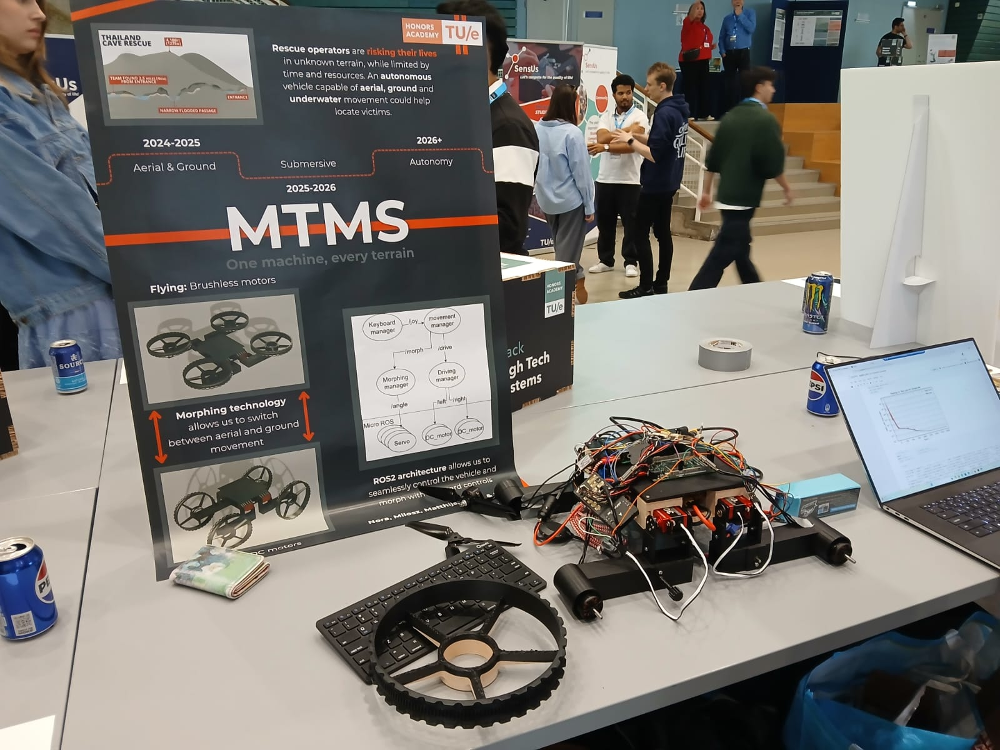
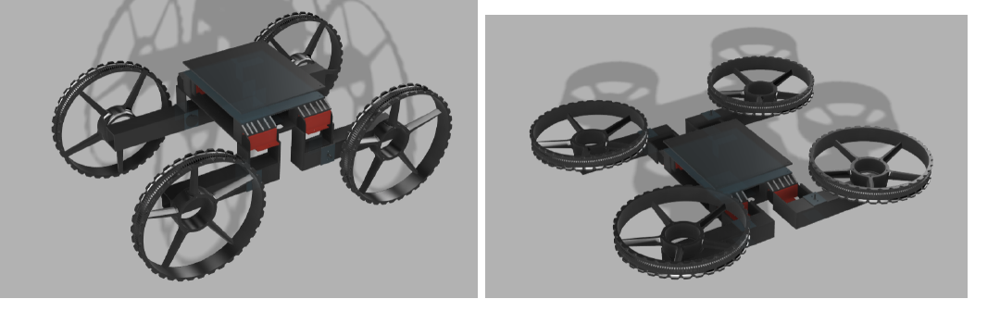

<p align="center">
  
</p>

<p align="center">
  
</p>

# Multi-Terrain Mobility System (MTMS)

MTMS is a land and air convertible robot built for the TU/e Honors Academy High Tech Systems track (Year 2, 2024-2025). The robot carries four legs, each holding a combined wheel and propeller. It drives on the ground like a rover, then physically rotates each leg by 90 degrees to point the propellers upward and take off as a quadcopter. The long-term motivation is a rescue vehicle that can reach victims across terrain that a single ground or aerial vehicle cannot cover on its own.

Over the year the team designed and built a working prototype: the mechanical chassis and morphing mechanism, a custom power distribution board, and a ROS 2 software stack that lets an operator drive the robot, trigger the transformation, and fly it from a single keyboard.

## Prototype

The mechanical design centers on a stack of plates that house the battery, power distribution, and compute, with four legs that each carry a wheel-propeller assembly. The two states below are the same robot: wheels down for driving, and rotated for flight.

<p align="center">
  
</p>

## Software architecture

The control software runs on ROS 2 (Jazzy) on a Raspberry Pi 5, with a micro-ROS firmware layer on an Arduino Due that drives the motors and servos. The nodes form a small pipeline from keyboard input down to hardware:

- `keyboard` and `keyboard_to_joy` capture keypresses through SDL and turn them into a `sensor_msgs/Joy` message. W/S and A/D map to the throttle and steering axes, Space is a boost button, and Q requests a mode change.
- `movement_manager` subscribes to `/joy` and routes input to either the `/drive` or `/fly` topic depending on the current mode. Pressing Q sends a `MorphAction` goal, with debouncing so a single press does not trigger repeated transitions.
- `drive_manager` converts the joystick axes into tank-style left and right motor commands and publishes them as PWM values on `/drive_left` and `/drive_right`.
- `morph_manager` is the `MorphAction` server. It sweeps the leg servos between the drive and fly positions in small steps through a `SetAngle` service and reports transition progress as feedback.
- The Arduino Due firmware (`code/Servo_sweeping`, PlatformIO) is a micro-ROS node. It subscribes to `/drive_left` and `/drive_right` to drive four DC motors and hosts the `servo_service` that rotates the four leg servos.

`movement_msgs` defines the custom `MorphAction` action and `SetAngle` service that tie these nodes together.

## Repository structure

```
code/ros_ws/            ROS 2 workspace
  src/movement_manager/  movement, drive and morph manager nodes
  src/movement_msgs/     MorphAction action and SetAngle service
  src/keyboard_controls/ keyboard capture and keyboard-to-joy conversion
  src/launch_mtms/       top-level launch files
code/Servo_sweeping/    micro-ROS firmware for the Arduino Due (PlatformIO)
code/startup.sh         boot script, paired with start_robot.service
BMS_schematic/          battery management KiCad project
mechanical/             CAD designs and STL exports
docs/                   logo, Gantt planning, report figures
Honors_report_2025.pdf  full project report
```

## Running it

Build the workspace and launch the stack on the robot:

```bash
cd code/ros_ws
colcon build
source install/setup.bash

# start the micro-ROS agent so the Arduino Due can join the ROS 2 graph
ros2 run micro_ros_agent micro_ros_agent serial --dev /dev/ttyACM0

# start the managers and keyboard control
ros2 launch launch_mtms launch_mtms_launch.py
```

The keyboard node opens a small window that must stay focused to receive input. On the robot itself the same flow is wired into `code/startup.sh` and a `start_robot.service` unit so everything comes up on boot.

## Hardware

- Raspberry Pi 5 as the main computer running the ROS 2 stack
- Arduino Due running the micro-ROS firmware for motor and servo control
- Pixhawk 6C flight controller for the aerial mode
- Brushless motors and propellers for flight, DC motors and servos for driving and morphing
- 22.2V 4000mAh 6S LiPo battery
- Custom power distribution PCB (KiCad) with XT60 input and multiple XT30 outputs

## Technologies

ROS 2 Jazzy, Python, micro-ROS, C++ (Arduino / PlatformIO), KiCad, CAD.

## Planning

Progress was tracked with Gantt charts that were revised as component deliveries and priorities shifted. The full schedule and milestones are in [docs/gantt_chart.svg](docs/gantt_chart.svg).

## Contributors

Team MTMS

- Alex Ceano Vivas i Camacho (coach, Honors High Tech Systems track)
- Nora Balje
- Daniel Tyukov
- Ismail Hassaballa
- Milosz Janewski
- Matthijs Smulders
